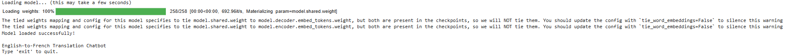
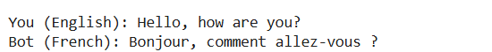
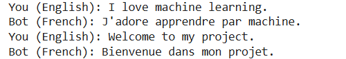
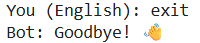

# English-to-French Translation Chatbot

## Overview

The English-to-French Translation Chatbot is a Natural Language Processing (NLP) project developed using Python and Hugging Face Transformers. The chatbot translates English sentences into French in real time using the pre-trained Helsinki-NLP/opus-mt-en-fr model.

The project provides an interactive chat interface where users can enter English text and receive French translations instantly. A typing effect is included to simulate a natural conversational experience.

## Features

- Real-time English to French translation
- Interactive chatbot interface
- Typing animation effect
- Supports multiple user inputs
- Exit commands (exit, quit, bye, goodbye)
- Uses a pre-trained NLP translation model

## Technologies Used

- Python
- Hugging Face Transformers
- PyTorch
- SentencePiece
- Natural Language Processing (NLP)

## Model Used

**Helsinki-NLP/opus-mt-en-fr**

This model is specifically trained for English-to-French machine translation and is available through the Hugging Face Model Hub.

## Installation

Install the required libraries:

```bash
pip install transformers torch sentencepiece
```

## Run the Project

```bash
python main.py
```

## Example

**Input:**

Hello, how are you?

**Output:**

Bonjour, comment allez-vous ?

## Project Structure

```text
English-to-French-Translation-Chatbot/
│
├── main.py
├── README.md
├── requirements.txt
├── LICENSE
├── .gitignore
├── English-to-French Translation Chatbot.docx
└── screenshots/
    ├── chatbot-startup.png
    ├── translation-example.png
    ├── multiple-translations.png
    └── exit-demo.png
```

## Learning Outcomes

- Understanding NLP applications
- Working with Hugging Face Transformers
- Using pre-trained machine learning models
- Building interactive chatbot systems
- Implementing language translation solutions

## Future Enhancements

- Multi-language translation support
- Speech-to-text integration
- Voice output functionality
- Graphical User Interface (GUI)
- Web application deployment
## Screenshots

### Startup



### Translation Example



### Multiple Translations



### Exit Functionality




## Author
**Bhukya Abhivardhan Nayak**  
B.Tech Biomedical Engineering

## Project Status
Completed ✅
